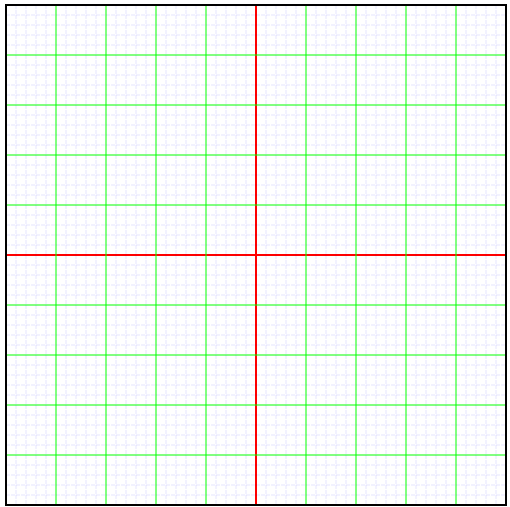
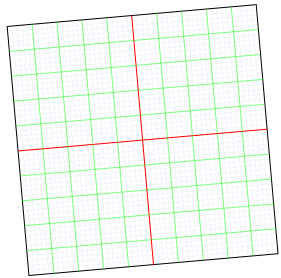

# SimpleGrid - A very basic two-dimensional grid in rectangular coordinates

SimpleGrid is a basic two-dimensional grid implementation using rectangular coordinates. A SimpleGrid object can be instantiated by passing the coordinate of the corner with minimum x and y values, say (*x_min*, *y_min*), the width and height of the rectangle. 

It is possible to set an origin point and *axes* function returns the start and end point coordinates of the horizontal and vertical axis lines.

One can either get the coordinates of major and minor lines (*majors/minors*) in a direction or end points of these lines (*majorLines/minorLines*). Lines are in the size of the grid (*width/height*) whose end coordinates are given in arrays of four elements.

Major lines are separated by a distance value and it is possible to skip borders of the domain and origin if a major line is sufficiently close to these locations. 

Specified number of minor lines are placed evenly on the intervals between the major lines.

It is also possible to obtain the bounding rectangle of the domain. (*boundingRectangle*)

Also, *svgGroup* static function parses the grid into an svg group node. In Example 2, same grid as Example 1 is regenerated. Before appending the group into a new svg node, some arbitrary transformation have been applied through the transform attribute of svg elements.

### Example 1: 

To create a grid that starts from (100,100) with a width of 500 and height of 500 units, 

```const aGrid = new SimpleGrid({xmin:100,ymin:100,width:500,height:500});```

To set an origin at the geometric center of this rectangle, 

```aGrid.origin({type:"set", x:350, y:350}); ```

or

```aGrid.origin({type:"anchor", x:0.5, y:0.5});```

To get the bounding rectangle: 

```aGrid.boundingRectangle();```
which returns an object with keys *x, y, width, height*.

To get major lines along x separated by 50 units by skipping the boundaries and origin,

```aGrid.majorLines({distance:50, skipBoundary:true, skipOrigin:true, direction: "x"});```
which returns array of array elements that are composed of four numbers denoting the end coordinates of the major lines.


To get major lines along y separated by 50 units by skipping the boundaries and origin,

```aGrid.majorLines({distance:50, skipBoundary:true, skipOrigin:true, direction: "y"}});```
This also returns array of array elements that are composed of four numbers denoting the end coordinates of the major lines.

To get 4 minor lines along x (divides the distance between adjacent major lines by five) between two adjacent major grid lines separated by 50 units. 

```aGrid.minorLines({number:4, distance:50, direction:"x"});```
which returns array of array elements that are composed of four numbers denoting the end coordinates of the minor lines.

To get 4 minor lines along y (divides the distance between adjacent major lines by five) between two adjacent grid lines separated by 50 units. 

```aGrid.minorLines({number:4, distance:50, direction:"y"});```
which returns array of array elements that are composed of four numbers denoting the end coordinates of the minor lines.

In the *test_simplegrid.js*, example grid is used to create the following svg step by step. 



Input to the functions are collected in a *settings* object as follows.

```
const settings = {
  geometry: { xmin: 100, ymin: 100, width: 500, height: 500 },
  boundingRectangle: {
    style: "fill:none; stroke:#000000; stroke-width:2",
  },
  origin: { type: "set", x: 350, y: 350 },
  axes: {
    stroke: "#FF0000",
    "stroke-width": 2,
  },
  majorLines: {
    configuration: {
      distance: 50,
      skipBoundary: true,
      skipOrigin: true,
    },
    attributes: {
      stroke: "#00FF00",
      "stroke-width": 1,
    },
  },
  minorLines: {
    configuration: {
      number: 4,
      distance: 50,
    },
    attributes: {
      stroke: "#0000FF",
      "stroke-width": 0.1,
      "stroke-dasharray": "4 1",
    },
  },
};
```


### Example 2

*settings* object in Example 1 is used as an input to the *svgGroup* function and some arbitrary transformation has been applied before appending the parsed group node into a new svg, which is then embedded into a *div* node in the *index.html* file.

```
const gridGroup = SimpleGrid.svgGroup(settings);
gridGroup.setAttributeNS(null, "transform", "scale(0.5) rotate(-5)");
```




### Roadmap

- Transformations will be applied directly. 
- Tick marks will be added.
- x and y axes will be made longer than the size of the bounding rectangle and axes ends may have arrow heads. 
- SVG grid output has a long way ahead but it is going to be made responsive, like zooming, dragging and other modifications through some input and anchor points if necessary. 
- Polar coordinates and curvilinear coordinates are going to be implemented.
- Tikz output will be implemented.